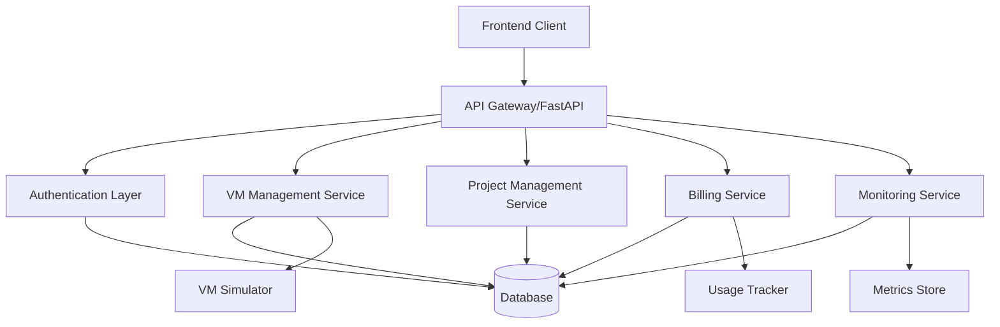
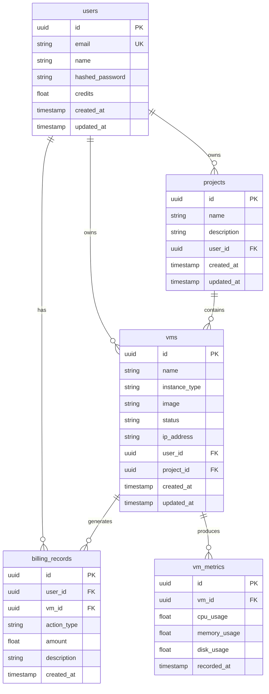

# Design Document

## Overview

This design document outlines the architecture and implementation approach for fixing and completing the Zentry Cloud backend API. The solution addresses missing features, inconsistencies, and incomplete implementations while maintaining backward compatibility and supporting both development and production environments.

The design focuses on creating a robust, scalable backend that provides comprehensive cloud platform functionality including authentication, VM management, project organization, billing, and monitoring capabilities.

## Architecture

### High-Level Architecture



### Service Layer Architecture

The backend will be organized into distinct service layers:

1. **API Layer**: FastAPI routers handling HTTP requests/responses
2. **Service Layer**: Business logic and orchestration
3. **Data Access Layer**: Database operations and models
4. **External Services**: VM simulation, metrics collection
5. **Middleware**: Authentication, logging, error handling

### Database Design



## Components and Interfaces

### 1. Enhanced Authentication Service

**Purpose**: Provide secure authentication with comprehensive error handling

**Key Components**:
- JWT token management with proper expiration
- Password hashing using bcrypt
- User session management
- Token refresh capabilities

**Interfaces**:
```python
class AuthService:
    async def signup(user_data: UserSignup) -> AuthResponse
    async def login(credentials: UserLogin) -> AuthResponse
    async def refresh_token(refresh_token: str) -> AuthResponse
    async def get_current_user(token: str) -> UserResponse
    async def update_profile(user_id: str, updates: UserUpdate) -> UserResponse
```

### 2. Complete VM Management Service

**Purpose**: Handle full VM lifecycle with proper state management

**Key Components**:
- VM creation with credit validation
- State management (creating, running, stopped, terminated)
- IP address allocation simulation
- Resource specification management

**Interfaces**:
```python
class VMService:
    async def create_vm(vm_data: VMCreate, user: UserResponse) -> VMResponse
    async def start_vm(vm_id: str, user: UserResponse) -> APIResponse
    async def stop_vm(vm_id: str, user: UserResponse) -> APIResponse
    async def restart_vm(vm_id: str, user: UserResponse) -> APIResponse
    async def delete_vm(vm_id: str, user: UserResponse) -> APIResponse
    async def get_vm_metrics(vm_id: str, user: UserResponse) -> VMMetrics
    async def get_pricing_info() -> PricingInfo
```

### 3. Project Management Service

**Purpose**: Organize VMs within projects with proper relationship management

**Key Components**:
- Project CRUD operations
- VM-project relationship validation
- Cascade delete handling
- Project statistics

**Interfaces**:
```python
class ProjectService:
    async def create_project(project_data: ProjectCreate, user: UserResponse) -> ProjectResponse
    async def get_projects(user: UserResponse) -> List[ProjectResponse]
    async def get_project_with_vms(project_id: str, user: UserResponse) -> ProjectWithVMs
    async def update_project(project_id: str, updates: ProjectUpdate, user: UserResponse) -> ProjectResponse
    async def delete_project(project_id: str, user: UserResponse) -> APIResponse
```

### 4. Billing and Usage Service

**Purpose**: Track usage and manage credits with detailed billing

**Key Components**:
- Credit deduction for VM operations
- Usage tracking and history
- Billing record generation
- Cost calculation engine

**Interfaces**:
```python
class BillingService:
    async def deduct_credits(user_id: str, amount: float, description: str) -> bool
    async def add_credits(user_id: str, amount: float, description: str) -> bool
    async def get_billing_history(user_id: str, limit: int = 50) -> List[BillingRecord]
    async def calculate_vm_cost(instance_type: str, hours: float) -> float
    async def get_usage_summary(user_id: str, period: str) -> UsageSummary
```

### 5. Monitoring Service

**Purpose**: Collect and provide VM metrics and system monitoring

**Key Components**:
- VM metrics simulation
- System health monitoring
- Performance data collection
- Alert generation

**Interfaces**:
```python
class MonitoringService:
    async def record_vm_metrics(vm_id: str, metrics: VMMetrics) -> bool
    async def get_vm_metrics(vm_id: str, period: str) -> List[VMMetrics]
    async def get_system_health() -> SystemHealth
    async def check_vm_status(vm_id: str) -> VMStatus
```

### 6. Database Service Layer

**Purpose**: Provide consistent database operations with proper error handling

**Key Components**:
- Connection management
- Query builders
- Transaction support
- Migration utilities

**Interfaces**:
```python
class DatabaseService:
    async def health_check() -> HealthStatus
    async def run_migrations() -> bool
    async def get_connection() -> Connection
    async def execute_query(query: str, params: dict) -> QueryResult
```

## Data Models

### Enhanced Models

```python
# Extended user model with additional fields
class UserResponse(BaseModel):
    id: str
    email: str
    name: str
    credits: float
    total_spent: float
    vm_count: int
    project_count: int
    created_at: datetime
    updated_at: Optional[datetime]
    last_login: Optional[datetime]

# VM model with comprehensive status tracking
class VMResponse(BaseModel):
    id: str
    name: str
    instance_type: str
    image: str
    status: VMStatus
    ip_address: Optional[str]
    user_id: str
    project_id: str
    specs: VMSpecs
    uptime_hours: float
    cost_per_hour: float
    total_cost: float
    created_at: datetime
    updated_at: Optional[datetime]
    last_started: Optional[datetime]

# Billing record model
class BillingRecord(BaseModel):
    id: str
    user_id: str
    vm_id: Optional[str]
    action_type: str
    amount: float
    description: str
    created_at: datetime

# VM metrics model
class VMMetrics(BaseModel):
    vm_id: str
    cpu_usage: float
    memory_usage: float
    disk_usage: float
    network_in: float
    network_out: float
    recorded_at: datetime
```

## Error Handling

### Standardized Error Responses

All endpoints will return consistent error responses:

```python
class ErrorResponse(BaseModel):
    success: bool = False
    error_code: str
    message: str
    details: Optional[dict] = None
    timestamp: datetime
```

### Error Categories

1. **Validation Errors (400)**: Invalid input data
2. **Authentication Errors (401)**: Invalid or missing tokens
3. **Authorization Errors (403)**: Insufficient permissions
4. **Not Found Errors (404)**: Resource doesn't exist
5. **Conflict Errors (409)**: Resource conflicts
6. **Rate Limit Errors (429)**: Too many requests
7. **Server Errors (500)**: Internal system errors

### Error Handling Strategy

- Global exception handlers for consistent responses
- Detailed logging for debugging
- User-friendly error messages
- Proper HTTP status codes
- Error tracking and monitoring

## Testing Strategy

### Unit Testing

- Test all service methods independently
- Mock external dependencies
- Validate error conditions
- Test edge cases and boundary conditions

### Integration Testing

- Test API endpoints end-to-end
- Validate database operations
- Test authentication flows
- Verify error handling

### Performance Testing

- Load testing for concurrent users
- Database query optimization
- Memory usage monitoring
- Response time validation

### Test Structure

```
tests/
├── unit/
│   ├── test_auth_service.py
│   ├── test_vm_service.py
│   ├── test_project_service.py
│   └── test_billing_service.py
├── integration/
│   ├── test_auth_endpoints.py
│   ├── test_vm_endpoints.py
│   └── test_project_endpoints.py
└── performance/
    ├── test_load.py
    └── test_concurrent_users.py
```

## Implementation Phases

### Phase 1: Core Infrastructure
- Enhanced error handling and validation
- Database schema updates and migrations
- Improved authentication service
- Basic monitoring and logging

### Phase 2: VM Management
- Complete VM lifecycle management
- VM metrics and monitoring
- Resource specification management
- State transition handling

### Phase 3: Billing and Usage
- Credit management system
- Usage tracking and billing records
- Cost calculation engine
- Billing history and reports

### Phase 4: Advanced Features
- VM performance monitoring
- Advanced project management
- API rate limiting
- Comprehensive testing

## Security Considerations

### Authentication Security
- Secure password hashing with bcrypt
- JWT token expiration and refresh
- Rate limiting on authentication endpoints
- Account lockout after failed attempts

### API Security
- Input validation and sanitization
- SQL injection prevention
- CORS configuration
- Request size limits

### Data Security
- Encrypted database connections
- Sensitive data encryption at rest
- Audit logging for sensitive operations
- Regular security updates

## Performance Optimization

### Database Optimization
- Proper indexing on frequently queried fields
- Connection pooling
- Query optimization
- Database monitoring

### API Optimization
- Response caching where appropriate
- Pagination for large datasets
- Async/await for I/O operations
- Request/response compression

### Monitoring and Metrics
- Application performance monitoring
- Database query performance
- Error rate tracking
- Resource utilization monitoring